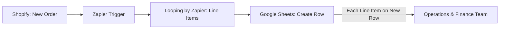

If you have an e-commerce store running on <a href="https://www.shopify.com/" target="_blank" rel="noopener noreferrer">Shopify</a> and are looking to supercharge it with automations to save hours of work per week, you're in the right place. In this guide I will take you through how you can use Zapier to automate your orders directly into a Google Sheet as well as some use cases to display how powerful this automation can be. 

## How to Automate Your Shopify Store with Zapier and Google Sheets

Running an online store is exciting, but can also be overwhelming. Between processing orders, updating your operations team, and analyzing profitability, **manual data entry quickly becomes a nightmare**.  Luckily, if you use an automation tool, you can save yoursel a lot of time (and stress) to focus on what actually matters - selling. With <a href="https://zapier.com/" target="_blank" rel="noopener noreferrer">Zapier</a>, you can connect **Shopify** and **Google Sheets** to **automatically update your orders in real time** - no manual copy-pasting required.  

In this guide, I’ll walk you through exactly how to set up Shopify - Google Sheets automation using Zapier, including how to handle **line items properly** so that each product ordered appears on its own row (because yes, there are some mistakes people make when starting out can can actually give you some headaches).  

## Why Automate Shopify Orders into Google Sheets?

Before diving into the “how,” let’s talk about the **why**. It's not just about the time efficiency, it's also about knowing how to strategically use the data in your disposal to make your business run smoothly. Some very important examples in which you can use this type of automation to your advantage are: 

 - ✅ passing order data to your operations team to ship the products to customers. Maybe you don't want to give them access to your shopify store, so you can automate just about the information they need to deliver their part.
 - ✅ pulling net sales data and cross map it againts your costs so you can automate profitability analysis - this workflow will save hours every week and reduce the margin for manual errors.  
 - ✅ product level performance tracking, so you can see exactly which products are driving your growth and which ones are not hitting the mark.

The beautiful thingabout automating your business, is that it all happens in real time. So whenever an order hits, you can automate it so that it appears instatnly in your google sheet, but also that your Ops team receives a slack message for example. This reduces manual misjudgement and speeds up operations.

## Step 1: What You Need Before Starting

Make sure you have the following ready:

1. **Shopify account** with an active store.  
2. **Google account** with access to Google Sheets.  
3. **Zapier account** (free or paid, depending on how many tasks you’ll run).  
4. A **Google Sheet** prepared with headers for the order data you want to capture (e.g. Order ID, Date, Customer Name, Product, Quantity, Price, Total, etc.).  

## Step 2: Create a New Zap in Zapier

1. Log in to your Zapier dashboard.  
2. Click **“Create Zap”**.  
3. Choose **Shopify** as the **Trigger app**.  
4. Select the **Trigger event**:  
   - **“New Order”** (automation triggers whenever a new order is placed).   
5. Connect your **Shopify account** to Zapier (you’ll need your store URL and permissions).  

Once connected, Zapier will pull in sample data from your Shopify store to test the trigger - just hit that test button at the bottom to see if't it's working.  

            <h3 style="margin: 0 0 12px 0; font-size: 20px; color: white; font-weight: 600;">
                Need help setting up your automation?
            </h3>
            <a href="/contact" style="
                display: inline-block; 
                background: rgba(255,255,255,0.2); 
                color: white; 
                padding: 2px 24px; 
                border-radius: 18px; 
                text-decoration: none; 
                font-weight: 600; 
                border: 2px solid rgba(255,255,255,0.3);
                transition: all 0.3s ease;
            " 
            onmouseover="this.style.background='rgba(255,255,255,0.3)'; this.style.transform='translateY(-2px)'"
            onmouseout="this.style.background='rgba(255,255,255,0.2)'; this.style.transform='translateY(0px)'">
                Get in Touch Today →
            </a>

## Step 3: Set Up Google Sheets as the Action

Before you start the below steps, make sure to create a google sheet and have it ready. Row 1 should have the elements of the order you want to pull, so for example, if you only want Order Number, Product Name and Customer shipping Address, these should be the titles of A1, B1 and C1 respectively. 

1. For the **Action app**, select **Google Sheets**.  
2. Choose the action **“Create Spreadsheet Row(s)”**.  
   - This is important - you want “rows” (plural) if you’re going to handle line items correctly.  
3. Connect your Google Sheets account.  
4. Select the spreadsheet and worksheet where your orders should be logged.  
5. Map the Shopify fields to your sheet headers:  
   - Order ID → Order ID  
   - Customer First Name → Customer Name  
   - Line Item Name → Product  
   - Line Item SKU → SKU  
   - Line Item Quantity → Quantity  
   - Line Item Price → Price  
   - Order Total → Total  

Zapier will now insert a row in your sheet whenever a new order is placed, under the top row which you should have previously set with the titles you want.

## Step 4: Handling Multiple Line Items (Looping)

Here’s where many Shopify - Google Sheets setups fail: **orders with multiple products**.  

By default, Zapier dumps all line items into a single cell, making the sheet messy and hard to use for ops or finance.  

To fix this, we use **Zapier’s Looping by Zapier app**:

1. After your Shopify trigger, click the **“+”** button to add another step.  
2. Search for **“Looping by Zapier”**.  
3. Choose **“Create Loop from Line Items”**.  
4. In the **Line Items field**, select the Shopify line item array (Product Name, SKU, Quantity, Price, etc.).  
5. Zapier will now “loop” through each product in the order one by one.  

Next, connect this loop to Google Sheets:  

- For each loop iteration, Zapier will create **a new row in your Google Sheet**, ensuring that:  
  - Product A → Row 1  
  - Product B → Row 2  
  - Product C → Row 3  

This means **each line item gets its own row**, which is much cleaner and far easier for your ops/finance team to use. Looping is ideal for product level analysis, but if you don't care about it for your particular use case, you can skip this step altogether. 

## Step 5: Test Your Zap

1. Place a test order in your Shopify store with multiple products.  
2. Run the Zap test.  
3. Check your Google Sheet - each product should appear as a **separate row**, with the correct customer and order details repeated across them.  

If something doesn’t map correctly, go back and adjust your field mappings in Zapier.

## Step 6: Turn On Your Zap

Once you’re happy with the setup:  

- Toggle your Zap to **“ON”**.  
- Zapier will now monitor your Shopify store 24/7 and update your Google Sheet automatically whenever a new order is placed.  

### Visual Workflow: Shopify → Zapier → Google Sheets

Here’s a simple flow diagram of how the automation works:

## Taking your automation even further

Once your Shopify - Google Sheets automation is live, you can extend it in powerful ways:

1. **Profitability tracking**: Add product cost data into your sheet, and use formulas to calculate gross margins automatically.  
2. **Ops team workflows**: Share the sheet with your warehouse/fulfillment team so they can process orders in real time.  
3. **Inventory monitoring**: Build a dashboard in Google Sheets to track product sales velocity.  
4. **Reporting automation**: Connect your Google Sheet to Looker Studio for real-time sales reports.  
5. **Notifications**: Use Zapier to send a Slack or Email alert whenever a high-value order comes in.  

## Nas' Note: Automating tasks will put you one step ahead

Manually exporting Shopify orders into spreadsheets is outdated. By using **Zapier to automate Shopify orders into Google Sheets**, you’ll save time, reduce errors, and unlock deeper insights for both your operations and finance teams. This simple automation can become the backbone of your e-commerce data workflows, helping your store grow without adding manual overhead.  So, if you’ve been spending hours exporting Shopify data, now is the time to let Zapier and Google Sheets do the heavy lifting.  

---

**Liked what you just saw?** Follow me on <a href="https://www.youtube.com/@sellingwithnas" target="_blank" rel="noopener noreferrer">Youtube</a> or connect on <a href="https://www.linkedin.com/in/nasser-mansurali-659145102/" target="_blank" rel="noopener noreferrer">LinkedIn</a> for more insights on growing e-commerce brands.

